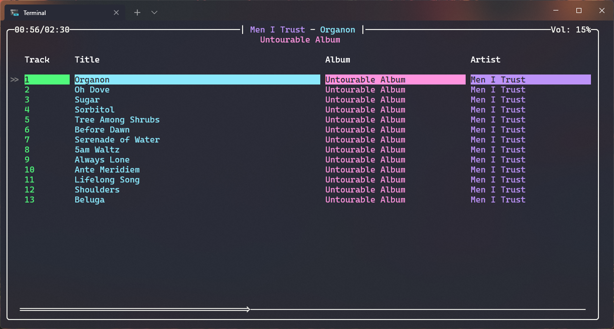

## Gronk

### TODO:

- [ ] Song metadata (duration)

- [ ] Toggles for artist/album/song only search

- [ ] Gronk player and UI should be seperate like mpd/client. The player should hold state such as the queue, volume and handle the music output.

- [ ] Global hotkeys
