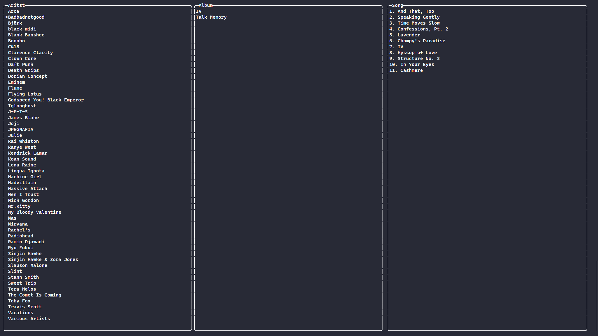

<h1 align="center" style="font-size: 55px">Gonk</h1>

<h3 align="center">A terminal music player.</h3>

<div align="center" style="display:inline">
      
</div>

## ✨ Features

- Vim-style key bindings
- Easy to use
- Fuzzy search
- Mouse support
- Cross-platform
- Plays FLAC, MP3, OGG, M4A and WAV

## 📦 Installation

> MacOS has not been testing.

> I recommend using a font with ligatures for the best experience.

#### Dependencies

Debian:

```
sudo apt install libasound2-dev pkg-config build-essential
```

Fedora:

```
dnf install alsa-lib-devel pkgconfig
```

Alpine:

```
apk add pkgconf alsa-lib-dev alpine-sdk
```

#### crates.io

```
cargo install gonk
```

Add your music:

```
gonk add D:/Music
```

## ⌨️ Key Bindings

Windows: `%appdata%/gonk/gonk.toml`

Linux: `~/.config/gonk/gonk.toml`

| Command              | Key             |
|----------------------|-----------------|
| Move Up              | `K / UP`        |
| Move Down            | `J / Down`      |
| Move Left            | `H / Left`      |
| Move Right           | `L / Right`     |
| Volume Up            | `W`             |
| Volume Up            | `S`             |
| Play/Pause           | `Space`         |
| Previous             | `A`             |
| Next                 | `D`             |
| Seek -10s            | `Q`             |
| Seek 10s             | `E`             |
| Delete Song          | `X`             |
| Clear Queue          | `C`             |
| Clear Except Playing | `Shift + C`     |
| Randomize Queue      | `R`             |
| Change Mode          | `Tab`           |
| Search               | `/`             |
| Update Database      | `U`             |
| Quit                 | `Ctrl + C`      |
| Move Song            | `1 / Shift + 1` |
| Move Album           | `2 / Shift + 2` |
| Move Artist          | `3 / Shift + 3` |

## ⚒️ Troubleshooting

If your music player has broken lines, increase your zoom level or font size.



## ❤️ Contributing

Feel free to open an issue or submit a pull request!
