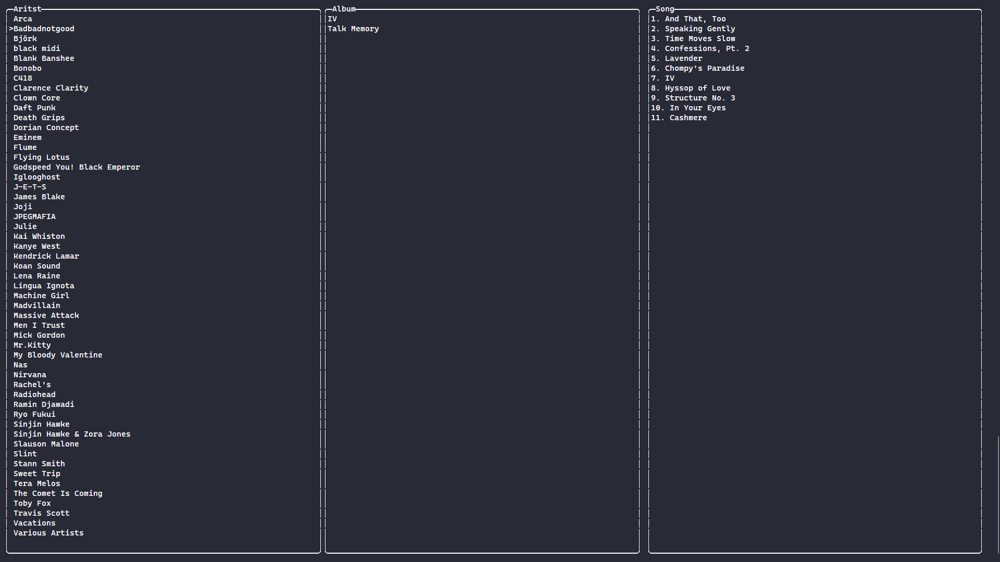

</think>

<h1 align="center" style="font-size: 55px">mu</h1>

<h3 align="center">A terminal music player.</h3>

<div align="center" style="display:inline">
      
</div>

## Features
- Easy to use
- Plays FLAC, MP3 and OGG
- Fuzzy search
- Vim-style key bindings
- Mouse support

##  Installation
> [!TIP]
> I recommend a font with ligatures for the best experience.

Download the latest [release](https://github.com/zfphex/mu/releases/latest) and add some music.

```
mu add ~/Music
```

### Building from Source

> [!WARNING]
> Linux and MacOS are currently unsupported.

```
git clone https://github.com/zfphex/mu
cd mu
cargo install --path mu --profile dist --features "simd"
mu
```

## Key Bindings

| Command                     | Key               |
| --------------------------- | ----------------- |
| Move Up                     | `K / Up`          |
| Move Down                   | `J / Down`          |
| Move Left                   | `H / Left`          |
| Move Right                  | `L / Right`          |
| Volume Up                   | `W`               |
| Volume Down                 | `S`               |
| Mute                        | `Z`               |
| Play/Pause                  | `Space`           |
| Previous                    | `A`               |
| Next                    | `D`               |
| Seek -10s                   | `Q`               |
| Seek 10s                    | `E`               |
| Clear queue                 | `C`               |
| Clear except playing        | `Shift + C`       |
| Select All                  | `Control + A`     |
| Add song to queue           | `Enter`           |
| Add selection to playlist   | `Shift + Enter`   |
| -                           |                   |
| Queue                       | `1`               |
| Browser                     | `2`               |
| Playlists                   | `3`               |
| Settings                    | `4`               |
| Search                      | `/`               |
| Exit Search                 | `Escape \| Tab`   |
| -                           |                   |
| Delete song/playlist        | `X`               |
| Delete without confirmation | `Shift + X`       |
| -                           |                   |
| Move song margin            | `F1 / Shift + F1` |
| Move album margin           | `F2 / Shift + F2` |
| Move artist margin          | `F3 / Shift + F3` |
| -                           |                   |
| Update database             | `U`               |
| Quit player                 | `Ctrl + C`        |

## Troubleshooting

- mu doesn't start after an update.

  Run `mu reset` to reset your database.
  If this doesn't work, you can reset the database by deleting `%appdata%/mu/` (Windows) or `~/.config/mu/` (Linux/Mac).

- If your music player has broken lines, increase your zoom level or font size.

  

## ❤️ Contributing

Feel free to open an issue or submit a pull request!
